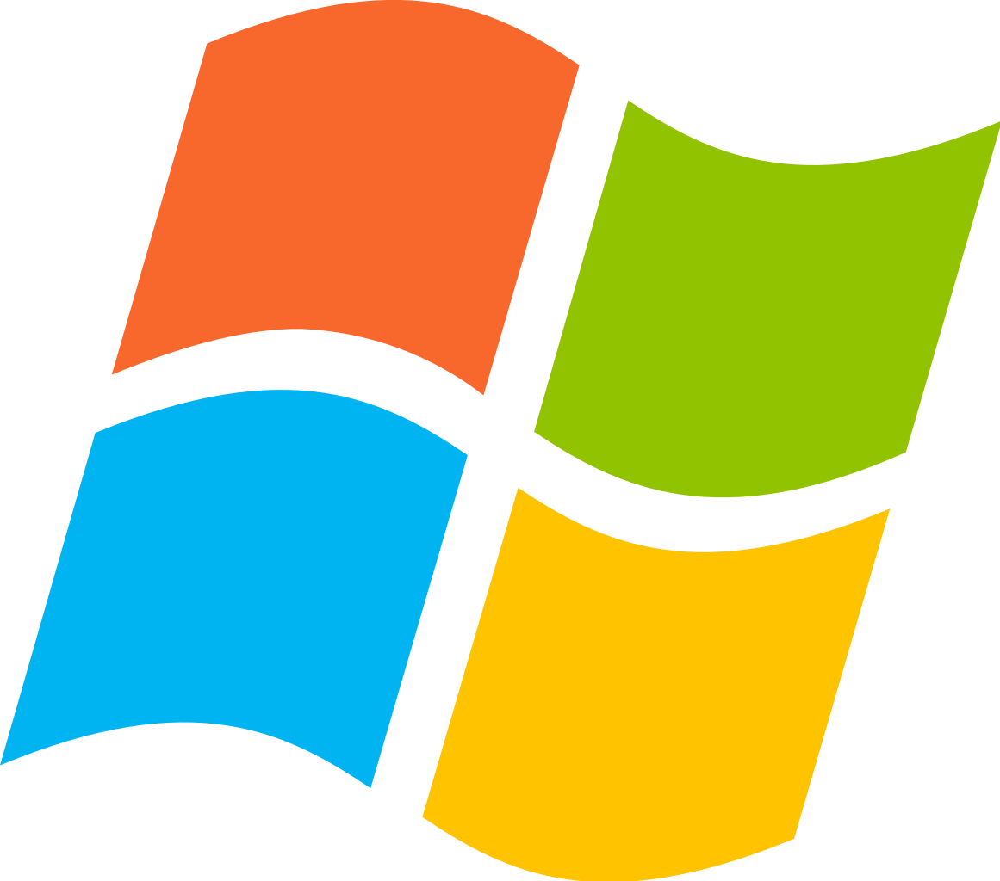
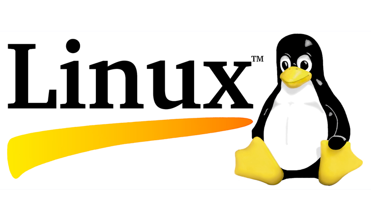

<!-- _backgroundColor: aquq -->

<!-- _color: purple -->

<!-- paginate: false -->

## CE103 Algorithms and Programming 

### Week-1 (Operating System)

#### Spring Semester, 2022-2023

Download [DOC](week-1.en.md_doc.pdf), [SLIDE](week-1.en.md_slide.pdf), [PPTX](week-1.en.md_slide.pptx)

<iframe width=700, height=500 frameBorder=0 src="../week-1.en.md_slide.html"></iframe>

---

<!-- paginate: true -->

### Outline

- Operating system's purpose
- Microsoft Windows
- linux

---

## Operating Systems

---

### 

- **Operating System's purpose**
An Operating System acts as a communication bridge (interface) between the user and computer hardware. The purpose of an operating system is to provide a platform on which a user can execute programs in a convenient and efficient manner. 

---

### 

- **Microsoft Windows**
Windows is an operating system that manages a personal computer known as a series of programs. It is a Microsoft-developed graphical operating system. This offers a way of data, apps running, playing video games, streaming videos and internet access. 

---

### 

- **Linux**
Just like Windows, iOS, and Mac OS, Linux is an operating system. In fact, one of the most popular platforms on the planet, Android, is powered by the Linux operating system. An operating system is software that manages all of the hardware resources associated with your desktop or laptop. 

---

**TODO** UPDATE CONTENT FOR YOUR COURSE NOTES

--- 

## References

- https://www.geeksforgeeks.org/functions-of-operating-system/#:~:text=The%20purpose%20of%20an%20operating,the%20allocation%20of%20computer%20hardware.
- https://www.linux.com/what-is-linux/

---

$End-Of-Week-1-Module$
